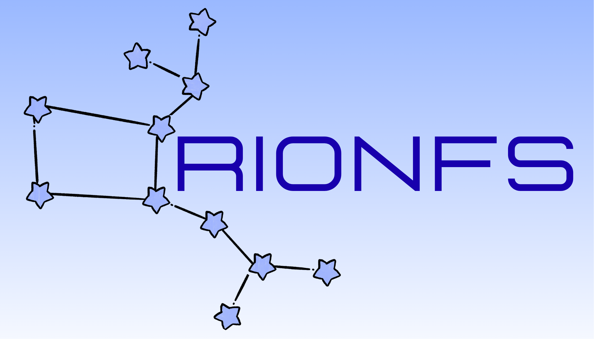
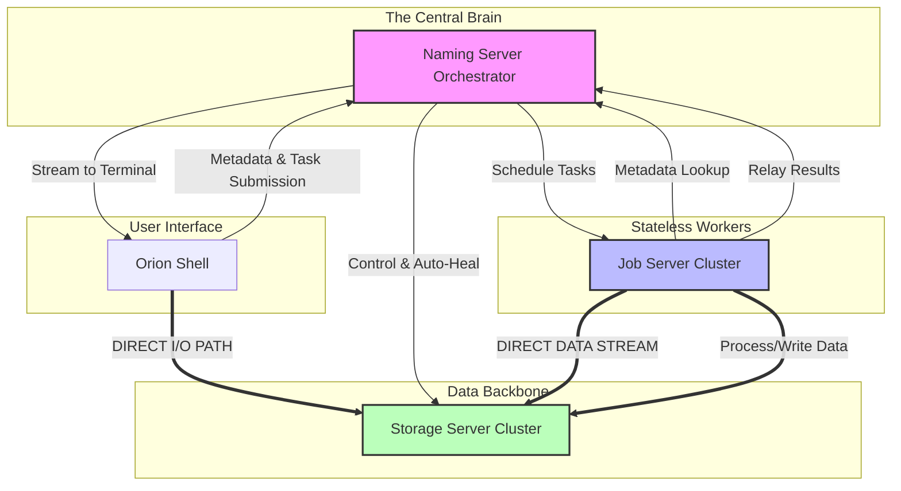
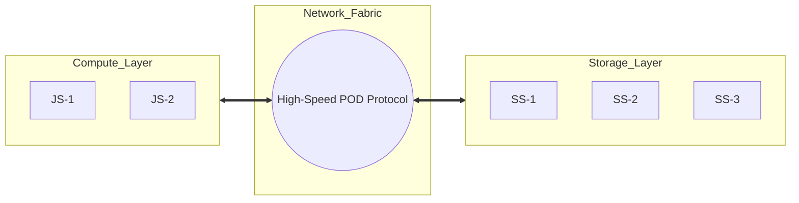

<div align="center">

[](https://isocpp.org/)
[](https://github.com/ujjwal-shekhar/DistributedNetworkFileSystem/tree/legacy-to-moderncpp)
[](https://opensource.org/licenses/BSL-1.0)




# 🌌 OrionFS

### Unified Distributed Data & Compute Engine

</div>

OrionFS is a high-performance system that fuses a **Decoupled Network File System** with a **Distributed Shell Execution Engine**, implemented using **Cutting-Edge C++ (C++20/23/26)**.

```text
        [ SS_1 ]
        [ SS_2 ] <=======> [ CLT ]
          ^                   ^
          |                   |
          |                 [ NM ]
          |                   |
          v                   v
        [ SS_(n-1) ] <====> [ JS1 ]
        [ SS_n ]            [ JS2 ]
```

---

## Key Features

- **📂 Hybrid Data/Compute Architecture:** A dual-purpose engine that serves as both a high-throughput **Distributed NFS** and a parallel **Job DAG Execution Engine**.
- **🚀 Distributed Shell (DAG):** Advanced scheduler that compiles complex shell strings into a Directed Acyclic Graph. Supports parallel branches, pipelines (`|`), sequential barriers (`;`), and background tasks (`&`).
- **🔗 Decoupled Data Path:** To maximize performance, OrionFS separates metadata from data. The Naming Server handles routing, while the Client and Job Servers stream bytes **directly** to/from Storage Servers.
- **🧊 Disaggregated Compute:** Dedicated Job Servers (`js`) provide stateless compute resources. Computation is decoupled from storage, allowing independent scaling and maximum fault isolation.
- **🦾 Dynamic Redundancy (Auto-Healing):** The Naming Server (`nm`) monitors node health. Upon failure, it orchestrates peer-to-peer re-replication between Storage Servers (`ss`) to maintain the target replication factor.
- **⚡ Modern C++ Core:** Built with **C++26** standards, utilizing C++20 Modules, `std::expected` for error propagation, `std::jthread` for RAII-based concurrency, and **C++26 Reflection**.
- **🛡️ Distributed Synchronization:** Fine-grained path-based locking ensures data integrity during concurrent `WRITE_FILE` operations across multiple replicas.
- **📟 Modernized C-Shell:** Feature-rich interactive CLI with terminal raw mode, ANSI color support, command history persistence, and logical VFS navigation (`warp`, `peek`).

---

## Technical Stack

- **Standard:** C++26 (using `g++-16`)
- **Build System:** CMake 3.30+ with Ninja
- **Testing:** Google Test (GTest) 1.14+
- **Virtualization:** Docker & Docker Compose
- **Language Features:** 
  - C++20 Modules & Partitions
  - **C++26 Reflection**
  - `std::expected` / `std::optional`
  - RAII Socket & Thread management

## Command Reference

| Command | Privilege Tier | Description |
| :--- | :--- | :--- |
| `warp <path>` | USER | Change local directory (client-side) |
| `peek [path]` | USER | List files in directory (DNFS) |
| `pastevents` | USER | Show command history |
| `pastevents purge` | USER | Clear command history |
| `pastevents execute <idx>` | USER | Execute a command from history |
| `job <cmd> [args] <file>` | USER | Execute a distributed job on the JS cluster |
| `LIST_ALL` | USER | List all files in the system |
| `READ_FILE <path>` | USER | Read the content of a file |
| `WRITE_FILE <p1> [p2]` | USER | Write content to a file (or from file `p2`) |
| `CREATE_FILE <path>` | PRIVILEGED | Create a new file |
| `CREATE_DIR <path>` | PRIVILEGED | Create a new directory |
| `DELETE_FILE <path>` | PRIVILEGED | Delete a file |
| `DELETE_DIR <path>` | PRIVILEGED | Delete a directory |
| `GET_FILE_INFO <path>` | USER | Get metadata for a file |
| `FAIL_SERVER` | ADMIN | Simulate a server failure |
| `exit` | USER | Exit the shell |

## Modular Architecture

OrionFS is strictly partitioned into 7 C++20 modules for separation of concerns and build efficiency:

- `client`: Interactive shell, DAG parsing, job submissions, and FS navigation.
- `naming-server`: Metadata, replication, and DAG task scheduling.
- `storage-server`: Data persistence, fine-grained locking, and I/O.
- `job-server`: Stateless compute engine for arbitrary task execution.
- `network`: RAII-based socket abstraction with binary stream synchronization.
- `commands`: Shared POD protocols and DAG structure definitions.
- `logger`: Location-aware, thread-safe, UTC-timestamped logging.

---

## Architecture Visualization

### 1. Centralized Control & Decoupled Data

OrionFS utilizes a hybrid communication model: metadata and orchestration flow through the Naming Server (NM), while high-volume data streams directly between the Client/Job Servers and the Storage Servers (SS).



### 2. Disaggregated Resource Model

Compute and Storage scale independently. Job Servers pull data locally only for the duration of a task.



---

## Component Usage

### 1. Naming Server (NM)
The central orchestrator that manages the metadata trie, tracks storage/job servers, and schedules DAG tasks.
```bash
./nm [min_ss] [replication_factor]
```

### 2. Storage Server (SS)
Data nodes that store files. They automatically create isolated storage roots per node.
```bash
./ss [storage_root] [nm_host] [nm_port]
```

### 3. Job Server (JS)
Stateless compute workers that execute shell commands on DFS data.
```bash
./js [nm_host] [nm_reg_port] [nm_clt_port]
```

### 4. Client (CLT)
Interactive shell for file operations and DAG job submission.
```bash
./clt [nm_host] [nm_port] [--history-size N]
```

**Advanced Syntax Examples:**
- **Parallel:** `job sleep 5 & sleep 5` (Runs on two JS nodes simultaneously).
- **Pipeline:** `job cat logs.txt | grep ERROR` (Distributed data-stream).
- **Mixed DAG:** `(job cat a.txt | grep X & job sleep 2) ; job echo "Done"` (Complex orchestration).

---

## Research & Inspirations

OrionFS is a modern realization of foundational distributed systems concepts, heavily inspired by:

- 📄 **Microsoft Dryad:** [Dryad: Distributed Data-Parallel Programs from Sequential Building Blocks](https://www.microsoft.com/en-us/research/publication/dryad-distributed-data-parallel-programs-from-sequential-building-blocks/)
- 📄 **Apache Hadoop HDFS:** [HDFS Design: Decoupled Data and Metadata](https://hadoop.apache.org/docs/stable/hadoop-project-dist/hadoop-hdfs/HdfsDesign.html)

---

## Origin and Refactoring

OrionFS originated as a collaborative team project in C. The current version, as presented here, represents a comprehensive modernization and architectural refactor led by me (Ujjwal Shekhar), transitioning the codebase to C++26 modules, implementing the disaggregated compute-storage engine, and introducing the distributed DAG scheduling and auto-healing capabilities.

**Original Team:**
*   Anika Roy
*   Prakul Agrawal
*   Ujjwal Shekhar (me)

