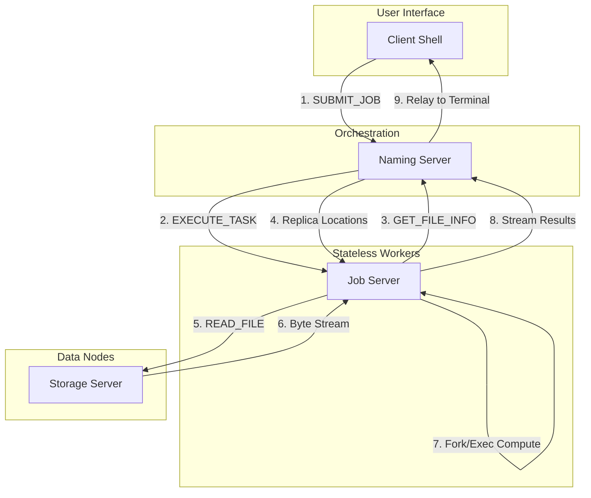
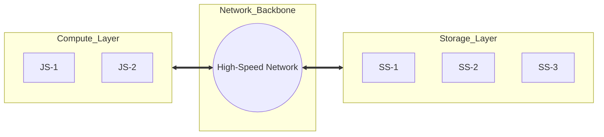

# Modern Distributed Network File System (mDNFS)

A high-performance, modular, and redundant distributed file system implemented using **Modern C++ (C++20/23/26)**.

## Key Features

- **Modern Architecture:** Strictly organized into 7 distinct C++20 modules (`client`, `naming-server`, `storage-server`, `job-server`, `network`, `commands`, and `logger`).
- **Distributed Shell:** Integrated interactive C-Shell with terminal raw mode, command history, and logical VFS navigation.
- **Disaggregated Compute:** Dedicated Job Servers (`js`) provide stateless compute resources, separating CPU-heavy tasks from storage I/O for maximum stability.
- **Arbitrary Job Execution:** Foundation for a distributed execution engine using `fork`/`exec` to run system binaries (`grep`, `wc`, `sort`) across the cluster.
- **High Performance Networking:** Robust POD-based binary protocol with full hostname resolution support for distributed environments (Docker-ready).
- **Dynamic Redundancy (Auto-Healing):** Naming Server automatically detects node failures and orchestrates SS-to-SS re-replication to maintain the target replication factor.
- **Full Synchronization:** `WRITE_FILE` operations are automatically synchronized across all online replicas.
- **Fault Tolerance & Chaos Resistance:** Automatic load balancing for `READ_FILE` and robust connection retry logic across all components.
- **Modern Concurrency:** Leverages `std::jthread`, `std::stop_token`, and fine-grained path-based locking for safe, high-concurrency access.

---

## Technical Stack

- **Standard:** C++26 (using `g++-16`)
- **Build System:** CMake 3.30+ (for C++26 support) with Ninja
- **Testing:** Google Test (GTest) 1.14+ (18+ tests including Client and Job partitions)
- **Virtualization:** Docker & Docker Compose for cluster simulation
- **Language Features:** 
  - C++20 Modules & Partitions
  - Static Reflection (P2996 style)
  - `std::expected` for error handling
  - `std::println`, `std::format` & `std::source_location` for UTC-timestamped logging
  - RAII-based Socket & Thread management

---

## Architecture Visualization

### 1. System Interaction Flow
The following diagram illustrates how a client-initiated `job` is orchestrated across the cluster.



### 2. Disaggregated Model
mDNFS uses a disaggregated architecture to ensure compute scaling does not impact storage performance.



---

## Component Usage

### 1. Naming Server (NM)
The central orchestrator that manages the file trie, tracks storage servers, and schedules jobs.
```bash
./nm [min_ss] [replication_factor]
```

### 2. Storage Server (SS)
Data nodes that store the files. They automatically create isolated storage roots.
```bash
./ss [storage_root] [nm_host] [nm_port]
```

### 3. Job Server (JS)
Stateless compute workers that execute arbitrary shell commands on DFS data.
```bash
./js [nm_host] [nm_reg_port] [nm_clt_port]
```
- `nm_reg_port`: Registration port for JS (default: 6051).
- `nm_clt_port`: Metadata query port (default: 8080).

### 4. Client (CLT)
Modernized interactive shell (C-Shell style) for performing file operations and submitting jobs.
```bash
./clt [nm_host] [nm_port] [--history-size N]
```
Available commands:
- `job <command> [args] <target_file>`: Execute a distributed job (e.g., `job grep "ERROR" server.log`).
- `warp <path>`: Change logical current working directory within the DNFS.
- `peek [path]`: List files in the logical directory.
- `pastevents [purge|execute <idx>]`: Manage or execute commands from the shell history.
- `CREATE_FILE <path>`: Create a replicated file.
- `READ_FILE <path>`: Read file content (load-balanced across replicas).
- `WRITE_FILE <path> [local_path]`: Copy local data or type directly into the DFS.
- `GET_FILE_INFO <path>`: View replica locations and network details.
- `DELETE_FILE <path>` / `DELETE_DIR <path>`: Redundantly remove data.

---

## Architecture Design

The system is built on a **Modular Micro-Kernel** approach:

1. **Commands:** Shared POD structures and protocol definitions (Binary-safe).
2. **Network:** RAII wrapper over POSIX Sockets with reliable `send_all`/`receive_all`.
3. **Logger:** Location-aware logging with UTC timestamps.
4. **Naming Server:** Thread-safe Trie and LRU cache for orchestration and job routing.
5. **Storage Server:** Fine-grained path-based locking and filesystem isolation.
6. **Job Server:** High-performance compute engine using `fork`/`exec` and stream relaying.
7. **Client:** Interactive shell with terminal raw mode and history navigation.

> **Design Note:** We utilize **Disaggregated Compute and Storage**. JS nodes are stateless and pull data from SS nodes on-demand. This provides perfect isolation between data persistence and computational workloads.

---

## AI Collaboration

This project was modernized, refactored, and tested using **Gemini CLI**, an interactive software engineering agent, focusing on C++26 standards, distributed robustness, and automated resilience testing.
